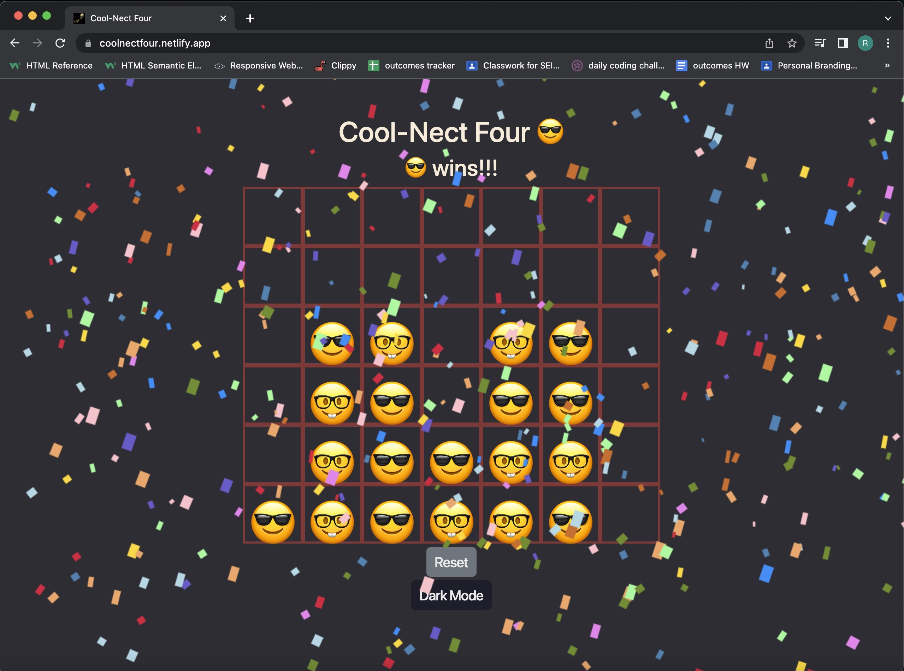

# Cool-Nect Four 😎: The Cool Guys Connect Four

> Built using JavaScript, CSS, HTML, and Bootstrap, this connect four game gives you a nice quick game with a fun twist when dark mode is activated. Play as Cool Guy or The Nerd and stack your way to victory, you legend.

Future enhancements: 
1. Change player tokens 
2. Add functionality and sound for Dork Mode 
3. Add animations and sounds for the tokens 
4. Add sound on a victory
5. Add a computer opponent with multiple difficulties

Audio credited to and owned by: Slipknot and Roadrunner Records

[Let's play!](https://coolnectfour.netlify.app/)

[Planning Materials](https://docs.google.com/document/d/1Kp4_XB1XHUgYnvmbvVJ7xP78vKW8b0Cwbs7HTCwxeew/edit)

[Dark mode background image credit](https://a.pinatafarm.com/612x521/f9813cb32a/badass-skeleton.jpg)

[Confetti source](https://github.com/SEI-Remote/confetti)

